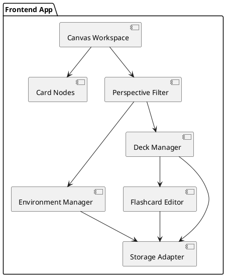
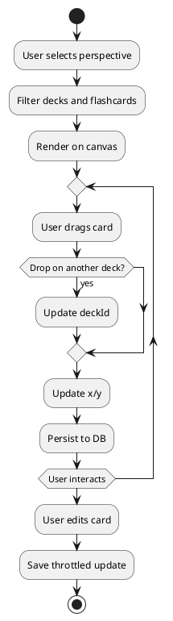

\= SPEC-1: Open Desk Flashcard Workspace
\:sectnums:
\:toc:

\== Background

Existing digital flashcard tools like Anki and Quizlet provide structured, list-based approaches to studying. While effective for spaced repetition, they often feel rigid and unnatural for users who think and organize visually or spatially. This design proposes a browser-based learning application centered around a freeform desk/canvas workspace where users can create, organize, and manipulate flashcards in an intuitive and personalized way.

The concept aims to support the natural flow of studying by allowing flashcards to be moved freely across "environments" and "perspectives," simulating how learners often mentally associate and reorganize concepts. It caters to individual students and lifelong learners seeking deeper control over their study patterns and topic interlinking.

The MVP version will support a single-user experience with local device storage to enable rapid iteration. Collaborative desk work and real-time cloud syncing are deferred to post-MVP phases.

\== Requirements

*Must Have*

* Ability to create, view, and edit flashcards with front/back content
* Drag-and-drop interface for moving flashcards across the open canvas
* Create and manage "environments" (e.g., Physics, DSA)
* Organize flashcards into "decks" within environments
* Change "perspective" to view a specific deck, environment, or combination
* Local device storage using IndexedDB or localStorage
* Basic UI for freeform spatial arrangement of flashcards on the desk

*Should Have*

* Search functionality for finding cards or decks
* Simple tagging or color-label system for flashcards
* Minimalist UI with intuitive gestures (e.g., right-click to create card)
* Auto-save and offline persistence

*Could Have*

* Flashcard review mode (manual or simple spaced repetition)
* Import/export functionality (JSON format)
* Basic analytics (e.g., card usage count, last edited)

*Won't Have (for MVP)*

* Real-time syncing or cloud storage
* Team collaboration on shared desks
* Advanced spaced repetition algorithms
* Mobile application

\== Method

\=== Architecture

* **Frontend Framework**: React
* **Canvas Rendering**: Konva.js (HTML5 Canvas wrapper)
* **State Management**: Zustand or Redux Toolkit
* **Persistence**: IndexedDB via Dexie.js
* **UI Library**: Tailwind CSS

\=== Component Overview



\=== Data Model (Dexie.js)

```ts
interface Environment {
  id: string;
  name: string;
  createdAt: number;
  updatedAt: number;
}

interface Deck {
  id: string;
  name: string;
  environmentId: string;
  createdAt: number;
  updatedAt: number;
}

interface Flashcard {
  id: string;
  deckId: string;
  front: string;
  back: string;
  x: number;
  y: number;
  color?: string;
  createdAt: number;
  updatedAt: number;
}
```

\=== Perspective Model

```ts
interface Perspective {
  environmentIds: string[];
  deckIds?: string[];
}
```

\=== Key Algorithms & Behaviors

* **Perspective Switching**

```pseudo
ON perspective change:
  - Filter environments and decks based on selection
  - Fetch all flashcards matching selected decks
  - Render only those flashcards on the canvas
```

* **Card Drag and Drop**

```pseudo
ON card drag:
  - Update card.x and card.y in local state
ON card drop:
  - Persist updated coordinates in IndexedDB
```

* **Deck Transfer via Drag**

```pseudo
ON card dropped onto another deck:
  - Update flashcard.deckId to target deck.id
  - Optionally snap position to target area
  - Save to IndexedDB
```

* **Canvas Zoom and Pan**

  * Use Konva.js built-in stage transform functions

* **Auto-Save**

  * Throttle save to IndexedDB every 1-2 seconds



\== Implementation

\=== Phase 1: Project Setup

* Initialize project using Vite + React + TypeScript
* Install and configure Tailwind CSS
* Set up Dexie.js for IndexedDB persistence
* Create basic routing and layout components

\=== Phase 2: Canvas Workspace

* Integrate Konva.js to render interactive canvas
* Implement pan and zoom behaviors
* Build draggable card nodes with snap-to-grid behavior
* Create context menu or buttons for adding cards

\=== Phase 3: Data Model Integration

* Implement Dexie.js schema for Environments, Decks, and Flashcards
* Create utility layer to load and persist data to IndexedDB
* Set up Zustand (or Redux Toolkit) to manage application state

\=== Phase 4: Core Features

* CRUD UI for Environments and Decks
* Perspective filter panel with multi-select for environments and decks
* Card editor modal or inline editor
* Implement drag-and-drop logic for moving cards and transferring decks
* Auto-save throttling for card movements/edits

\=== Phase 5: UI Polish & Usability

* Responsive layout for canvas and side panels
* Basic card tagging and color support
* Implement dark/light theme toggle
* Add tooltips, shortcut hints, and error handling

\=== Phase 6: Persistence Enhancements

* Implement versioning/migration for Dexie schema
* Add JSON import/export for full desk state

\== Milestones

*Milestone 1: Workspace Foundation (Week 1-2)*

* Project scaffolded with Vite, React, Tailwind
* Konva canvas integrated with basic card rendering
* Pan and zoom functional on canvas

*Milestone 2: Core Data Integration (Week 3)*

* IndexedDB via Dexie.js set up with schema
* Zustand/Redux Toolkit managing state
* Load/save flashcards and environments from storage

*Milestone 3: Interaction MVP (Week 4)*

* Drag-and-drop card movement and persistence
* Deck CRUD with basic UI
* Perspective filter panel functional

*Milestone 4: Flashcard Editing and UX Polish (Week 5)*

* Card editing modal implemented
* Environment CRUD UI done
* Throttled auto-saving, tag colors, UI refinement

*Milestone 5: Persistence & Export (Week 6)*

* JSON import/export implemented
* Data schema migration/versioning supported
* Bug fixing and MVP stabilization

*Milestone 6: Private Alpha Release (Week 7)*

* Internal testing with real users
* Feedback collection
* Prepare plan for collaboration and cloud sync for v2

\== Gathering Results

To assess the effectiveness of the MVP, both qualitative and quantitative methods will be used:

\=== Functional Validation

* Ensure all "Must Have" features are implemented and stable
* Manually verify that cards persist correctly across sessions
* Confirm that environment, deck, and perspective filters operate as expected
* Validate drag-and-drop accuracy and behavior across deck and environment contexts

\=== Usability Feedback (Private Alpha)

* Recruit 5–10 test users with study goals (students, professionals)
* Collect structured feedback on:

  * Ease of organizing and moving cards
  * Perceived naturalness of the workspace
  * Utility of environments and perspectives
* Observe usage patterns and pain points

\=== Performance Monitoring

* Measure IndexedDB read/write latencies for 500–1000 card decks
* Benchmark canvas interaction performance (drag, zoom) at scale
* Log and analyze auto-save efficiency and possible state sync delays

\=== Success Criteria

* 80%+ of test users report the canvas model is easier or more intuitive than list-based tools
* No major bugs or data loss reported during alpha period
* MVP is installable and runs consistently across Chrome, Firefox, and Safari

Future development will be informed by user feedback and system profiling results.
